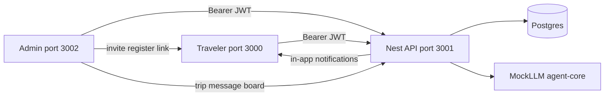
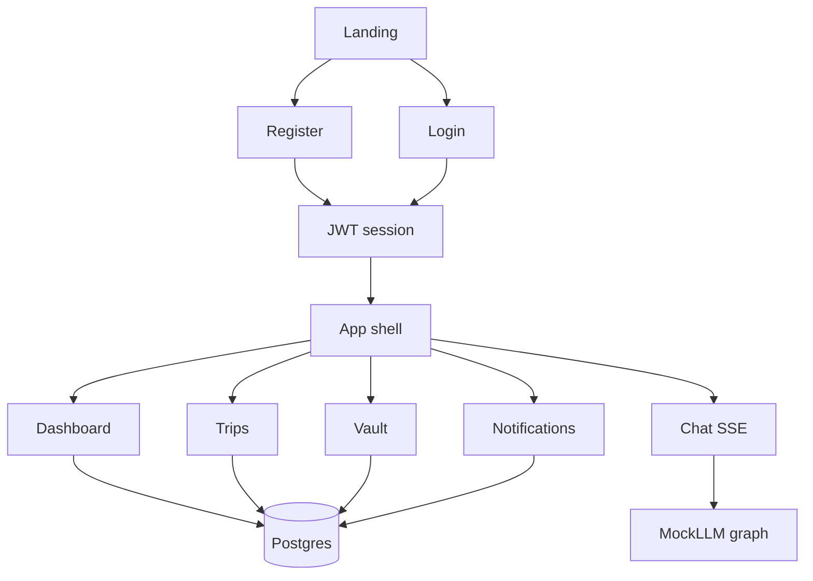
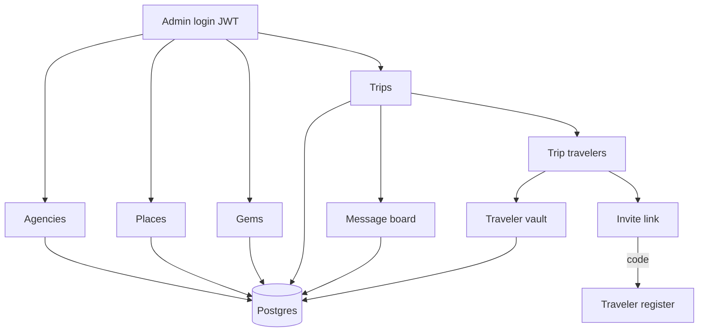

B2B2C Agentic Travel OS — tour operators run trips in the admin portal; travelers use the mobile-shaped client app. NestJS API + Postgres power data; chat uses a MockLLM. Product blueprint: [`ARCHITECTURE.md`](../ARCHITECTURE.md) in the repo root (Working POC in §8; deferred work in §9). On GitHub Pages that relative link only works from the repository tree; this page is **what the product does today**.

## Legend — Mock vs Real

**Real** — NestJS endpoint hits Postgres (or writes a file under `apps/api-server/uploads/` for vault).

**Mock** — Client-only UI, MockLLM responses, or demo Stripe checkout with no payment provider.

**Partial** — Real transport or persistence mixed with MockLLM or non-production billing.

| App                     | URL                   |
| ----------------------- | --------------------- |
| Traveler (`client-app`) | http://localhost:3000 |
| API (`api-server`)      | http://localhost:3001 |
| Admin (`admin-portal`)  | http://localhost:3002 |

Local bootstrap: `pnpm start:dev` (Docker Postgres + Redis → migrate → seed-if-empty → apps). Demo password for all seeded users: **`password123`**.

---

## System overview

| Hop                                                        | Status                                                                                                     |
| ---------------------------------------------------------- | ---------------------------------------------------------------------------------------------------------- |
| Traveler / admin → Nest REST & chat                        | Real HTTP + Bearer JWT                                               |
| Nest → Postgres (trips, vault, itinerary, agencies, board) | Real                                                                 |
| Nest → chat graph                                          | Partial Real SSE + Mock LLM |
| Registration Path A (monthly / Stripe UI)                  | Mock — no live Stripe                                                |
| Invite Path B (`register-invite` + DB code)                | Real                                                                 |

---

## Traveler product

### Entry & auth

| Step            | What happens                                          | Status                                                             |
| --------------- | ----------------------------------------------------- | ------------------------------------------------------------------ |
| Landing `/`     | Marketing + CTAs to register / login                  | Mock static UI               |
| Login `/login`  | Email + password → `POST /auth/login`                 | Real JWT + bcrypt            |
| Register Path A | “Monthly” signup UI                                   | Mock Stripe checkout UI only |
| Register Path B | Invite code → `POST /auth/register-invite`            | Real                         |
| Signup          | `POST /auth/signup` (independent traveler)            | Real                         |
| Session         | `localStorage` `tb:session:v1` (`accessToken` + user) | Real                         |

API calls send `Authorization: Bearer <token>` only.

### In-app screens

| Screen        | Route                       | Status                                           | Notes                                                                                                                                                                                                       |
| ------------- | --------------------------- | ------------------------------------------------ | ----------------------------------------------------------------------------------------------------------------------------------------------------------------------------------------------------------- |
| Home          | `/app`                      | Real       | Upcoming trips, day plan, documents you’ll need (each with show more / less); attachment badge on day stops when a vault doc is linked                                                                      |
| Trips list    | `/app/trips`                | Real       | Create personal trips; delete personal only; agency trips labeled                                                                                                                                           |
| Trip detail   | `/app/trips/detail?tripId=` | Real       | Static-export safe query param. Personal: full edit (manual days/items + add-from-gem). Agency: read-only + **Copy to my trips** + message board (`?panel=board`). Agentic day enrichment is not wired yet. |
| Vault         | `/app/vault`                | Real       | Upload / Save / delete; attach docs to day items from trip detail; deep link `?docId=`                                                                                                                      |
| Notifications | `/app/notifications`        | Real       | Header bell + unread count; trip board + agency vault posts; mark one / mark all read                                                                                                                       |
| Chat          | `/app/chat`                 | Partial | Nest SSE Real; MockLLM tools Mock (no OCR/RAG)                                                                                  |

**Personal vs agency trips:** personal trips (`operatorId` null) are editable by the traveler. Agency-managed trips are view-only; travelers copy them to edit. Vault documents on agency trips stay with the agency trip and are duplicated onto the copy.

### Chat tools (MockLLM)

| Tool                        | Role                                | Status                                             |
| --------------------------- | ----------------------------------- | -------------------------------------------------- |
| `showTicket`                | Ticket / pass style generative card | Mock payload |
| `generateItineraryTimeline` | Timeline-style generative card      | Mock payload |

Stream path: `useChat` → `POST /chat` → MockLLM graph in `@travel-bug/agent-core`. No Next Route Handlers in `client-app` (Capacitor static export).

---

## Admin / agency product

### Auth & roles

| Step          | Status                                     | Notes                                                          |
| ------------- | ------------------------------------------ | -------------------------------------------------------------- |
| Login         | Real | `/login` → `POST /auth/login`; token in `tb:admin-token:v1`    |
| Authorization | Real | Nest `JwtAuthGuard` + `RolesGuard`; UI hides tabs by role only |

| Role             | Typical nav                                              | Can do                                                                |
| ---------------- | -------------------------------------------------------- | --------------------------------------------------------------------- |
| `superadmin`     | Dashboard, Agencies, Places, Trips, Gems, Staff, Clients | Platform operators, places CRUD, all agency trips, gems               |
| `agency_manager` | Dashboard, Places, Trips, Gems, Staff, Clients           | Staff, trips, clients, gems for operator, message board, vault upload |
| `agency_agent`   | Dashboard, Places, Trips, Gems, Clients                  | Trips, clients, gems browse/use, message board, vault upload          |

### Agency operations

| Action                     | API / UI                                     | Status                                                                                                                        |
| -------------------------- | -------------------------------------------- | ----------------------------------------------------------------------------------------------------------------------------- |
| Agencies                   | `GET/POST /agencies`                         | Real — superadmin                                                                       |
| Places tree                | `GET/POST/PATCH/DELETE /places`              | Real — superadmin write                                                                 |
| Hidden gems                | `GET/POST/PATCH/DELETE /gems`                | Real — tenant + place scoped                                                            |
| Trips list / create / edit | `/agencies/trips`                            | Real — title, dates, itinerary (manual + add-from-gem; enrichment agents not wired yet) |
| Message board              | `GET/POST /trips/:tripId/messages`           | Real — one-way to travelers                                                             |
| Trip travelers             | `GET/POST /agencies/trips/:tripId/clients`   | Real — paginated + search                                                               |
| Per-traveler vault         | `/trips/[id]/travelers/[userId]` + vault API | Real — upload notifies traveler                                                         |
| Invite unknown email       | `invites` row + client register link         | Real                                                                                    |

Hidden gems visibility: `(operator_id IS NULL OR operator_id = :agency)` plus place subtree. Day items can focus a place; add-from-gem respects that scope.

---

## Auth model

| Piece            | Detail                                                           |
| ---------------- | ---------------------------------------------------------------- |
| Transport        | `Authorization: Bearer <jwt>`                                    |
| Claims           | `sub`, `email`, `role`, `operatorId`                             |
| Roles            | `superadmin` \| `agency_manager` \| `agency_agent` \| `traveler` |
| Password         | bcrypt hashes in `users.password_hash`                           |
| Traveler session | `tb:session:v1`                                                  |
| Admin session    | `tb:admin-token:v1` + `tb:admin-user:v1`                         |

---

## Try the demo

Seeded via `pnpm db:seed` (stable UUIDs in `packages/db/src/seed-ids.ts`). Password for all: **`password123`**.

| Who                  | Email                       | Notes                                  |
| -------------------- | --------------------------- | -------------------------------------- |
| Superadmin           | `superadmin@travelbug.demo` | Admin portal                           |
| Agency manager       | `manager@wanderlust.pro`    | Wanderlust Pro                         |
| Agency agent         | `agent@wanderlust.pro`      | Wanderlust Pro                         |
| Independent traveler | `solo@travelbug.demo`       | Owns Solo Paris Escape                 |
| Agency client        | `client@wanderlust.pro`     | Paris VIP + Tokyo Week; board + notifs |
| Legacy traveler id   | `traveler@travelbug.demo`   | Seeded user                            |

| Demo artifact | Value / tip                                 |
| ------------- | ------------------------------------------- |
| Invite code   | `PARIS-VIP` (pending invite in DB)          |
| Agency trips  | Wanderlust Paris VIP, Wanderlust Tokyo Week |
| Personal trip | Solo Paris Escape                           |
| Message board | Tokyo welcome + typhoon alert (seeded)      |
| Vault example | Agency boarding pass on Paris VIP           |

---

## Future AI capabilities

Three separate outcomes beyond the Working POC (see ARCHITECTURE §6 agents and §9). Chat MockLLM today is **not** the same as itinerary enrichment or vault RAG.

| Capability               | Product outcome                                                                                                                                                                                                              |
| ------------------------ | ---------------------------------------------------------------------------------------------------------------------------------------------------------------------------------------------------------------------------- |
| **Concierge chat**       | Real LLM behind Nest SSE chat (replaces MockLLM tool cards).                                                                                                                                                                 |
| **Vault intelligence**   | OCR on uploads → `document_chunks` → answers from the traveler’s own documents.                                                                                                                                              |
| **Itinerary enrichment** | Agents that suggest **programs / activities** into the day plan when building a trip (admin + traveler): operator **hidden gems** first, optional live web fill — writing structured itinerary stops, not only chat replies. |

---

## Not in this POC

Also out of the Working POC (ARCHITECTURE §9):

- Device **push** notifications (in-app notifications and the header bell are in scope)
- Live Stripe Checkout
- Hosted IdP (Auth0 / NextAuth / cookie sessions)
- Capacitor offline SQLite / offline maps
- Operator brand theming driven by `brand_config`
- Generative UI beyond ticket + timeline cards
