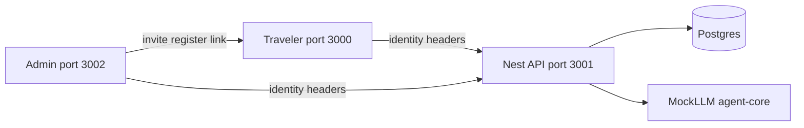
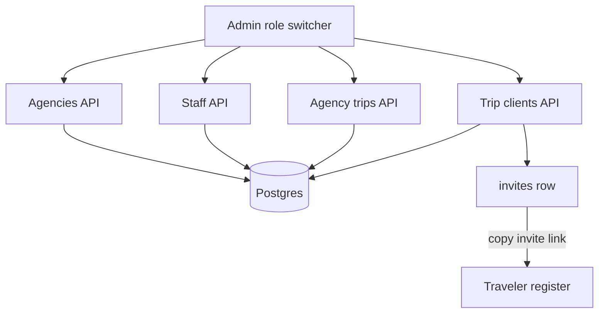

Working POC snapshot (Phases 1–4). Product blueprint: [`ARCHITECTURE.md`](../ARCHITECTURE.md) in the repo root (§8 in scope, §9 out). On GitHub Pages that relative link only works from the repository tree; this page documents **what is implemented today**.

## Legend — Mock vs Real

<div class="legend" markdown="1">

**Real** — NestJS endpoint hits Postgres (or writes a file under `apps/api-server/uploads/` for vault).

**Mock** — Client-only UI, `localStorage` identity, hardcoded invite codes, MockLLM responses, or SWR fallback data when the API is down.

**Partial** — Real transport or read path mixed with mock auth, mock LLM, or non-persisted UI actions.

</div>

| App | URL |
|-----|-----|
| Traveler (`client-app`) | http://localhost:3000 |
| API (`api-server`) | http://localhost:3001 |
| Admin (`admin-portal`) | http://localhost:3002 |

---

## System overview



| Hop | Status |
|-----|--------|
| Traveler / admin → Nest REST & chat | <span class="badge badge-real">Real</span> HTTP |
| Nest → Postgres (trips, vault, itinerary, agencies) | <span class="badge badge-real">Real</span> |
| Nest → chat graph | <span class="badge badge-partial">Partial</span> Real SSE + <span class="badge badge-mock">Mock</span> LLM |
| Identity / login / Stripe / invite redeem | <span class="badge badge-mock">Mock</span> |

---

## Traveler flow

```mermaid
flowchart TD
  landing[Landing]
  login[Login]
  register[Register]
  session[localStorage session]
  appShell[App shell]
  trips[Trips API]
  vault[Vault API]
  itin[Itinerary API]
  chat[Chat SSE]
  pg[(Postgres)]
  graph[MockLLM graph]

  landing --> login
  landing --> register
  register -->|Path A or B| session
  login -->|any password| session
  session --> appShell
  appShell --> trips
  appShell --> vault
  appShell --> itin
  appShell --> chat
  trips --> pg
  vault --> pg
  itin --> pg
  chat --> graph
```

### Entry & auth

| Step | What happens | Status |
|------|----------------|--------|
| Landing `/` | Marketing + CTAs to register/login | <span class="badge badge-mock">Mock</span> static UI |
| Login `/login` | Any non-empty email + any password | <span class="badge badge-mock">Mock</span> |
| Register Path A | “Monthly” + mock Stripe checkout | <span class="badge badge-mock">Mock</span> — no Nest, no live Stripe |
| Register Path B | Invite code checked in the browser | <span class="badge badge-mock">Mock</span> — codes `PARIS-VIP`, `AGENCY2026` only |
| Session | `localStorage` key `tb:session:v1` | <span class="badge badge-mock">Mock</span> — `userId` always seed traveler `…000010` |

API calls send `x-user-id`, `x-operator-id`, `x-user-role` from that session (see [Identity](#identity-headers)).

### In-app screens

| Screen | Route | Status | Notes |
|--------|-------|--------|-------|
| Home | `/app` | <span class="badge badge-partial">Partial</span> | `GET /trips` <span class="badge badge-real">Real</span>; SWR fallback `mockTrips`; alerts hardcoded |
| Trips list / create | `/app/trips` | <span class="badge badge-real">Real</span> | `GET/POST /trips`; create may optimistically keep local trip on failure |
| Trip detail header | `/app/trips/[tripId]` | <span class="badge badge-mock">Mock</span> | Destination/dates from `mockTrips`, not API trip row |
| Itinerary timeline | same | <span class="badge badge-partial">Partial</span> | `GET /itinerary/:tripId` <span class="badge badge-real">Real</span> read; initial UI uses `mockTimeline` |
| Attach from vault | same | <span class="badge badge-mock">Mock</span> | Local React state + `mockDocuments` picker — not persisted |
| Vault list / upload | `/app/vault` | <span class="badge badge-real">Real</span> | `GET/POST /vault/documents`; file on disk under `uploads/`; **no OCR** |
| Chat | `/app/chat` | <span class="badge badge-partial">Partial</span> | Nest SSE <span class="badge badge-real">Real</span>; MockLLM tools <span class="badge badge-mock">Mock</span> (no DB/RAG) |

### Chat tools (MockLLM)

| Tool | Trigger keywords (approx.) | Status |
|------|----------------------------|--------|
| `showTicket` | ticket / museum / louvre / pass | <span class="badge badge-mock">Mock</span> payload |
| `generateItineraryTimeline` | plan / itinerary / timeline / tomorrow | <span class="badge badge-mock">Mock</span> payload |

Stream path: `useChat` → `POST /chat` → `runMockConciergeGraph` in `@travel-bug/agent-core`. No Next Route Handlers in `client-app` (Capacitor static export).

---

## Admin / agency flow



### Auth & roles

| Step | Status | Notes |
|------|--------|-------|
| Login page | <span class="badge badge-mock">Mock</span> | None — sidebar **Viewing as** switcher |
| Role persistence | <span class="badge badge-mock">Mock</span> | `localStorage` `tb:admin-role:v1` |
| Demo identities | <span class="badge badge-mock">Mock</span> | Hardcoded seed UUIDs in `admin-api.ts` |

| Role | Nav | Can do (API) |
|------|-----|----------------|
| `superadmin` | Dashboard, Agencies, Trips | List/create agencies; list all trips; view clients. **Cannot** create trips/staff/clients |
| `agency_manager` | Dashboard, Trips, Staff | Staff list/create; trips list/create; clients list/add |
| `agency_agent` | Dashboard, Trips | Trips list/create; clients list/add (no Staff nav) |

RBAC is enforced on Nest with `@Roles` + header `x-user-role` (<span class="badge badge-partial">Partial</span> — real guards, mock trust of headers).

### Agency operations

| Action | API | Status |
|--------|-----|--------|
| List / create agencies | `GET/POST /agencies` | <span class="badge badge-real">Real</span> — create inserts `operators` + manager `users` |
| List / create staff | `GET/POST /agencies/staff` | <span class="badge badge-real">Real</span> — create is immediate user insert, not email invite |
| List / create trips | `GET/POST /agencies/trips` | <span class="badge badge-real">Real</span> — no edit/delete |
| List / add clients | `GET/POST /agencies/trips/:tripId/clients` | <span class="badge badge-real">Real</span> |
| Existing user → trip | `trip_travelers` insert | <span class="badge badge-real">Real</span> |
| Unknown email → invite | `invites` + code `INVITE-…` | <span class="badge badge-real">Real</span> DB row |
| Traveler redeems invite | `/register?code=` | <span class="badge badge-mock">Mock</span> — only hardcoded `PARIS-VIP` / `AGENCY2026`; **API `INVITE-…` codes are not redeemed** |

Trip edit, itinerary edit, and gems ingest UI are **not built** for agencies.

---

## Identity headers

Entire auth model is <span class="badge badge-mock">Mock</span> until ARCHITECTURE §9.

| Header | Purpose | Default if missing |
|--------|---------|-------------------|
| `x-user-id` | Acting user UUID | Seed traveler |
| `x-operator-id` | Agency / operator UUID; literal `null` for superadmin | Seed operator |
| `x-user-role` | `superadmin` \| `agency_manager` \| `agency_agent` \| `traveler` | `traveler` |

Implemented in `apps/api-server/src/auth/identity.ts` (`IdentityGuard` as app guard).

---

## Key seed IDs

From `packages/db/src/seed-ids.ts` (stable demo UUIDs):

| Key | Value |
|-----|--------|
| operator | `00000000-0000-4000-8000-000000000001` |
| traveler | `…000010` |
| trip (Paris) | `…000020` |
| itinerary / day1 / day2 | `…000021` / `…022` / `…023` |
| docs passport / insurance / louvre | `…031` / `…032` / `…033` |
| invite | `…050` · code **`PARIS-VIP`** |
| Demo login email | `traveler@travelbug.demo` |
| Client-only invite (not in DB) | `AGENCY2026` |

---

## Not in this POC (ARCHITECTURE §9)

- Real auth (Auth0 / NextAuth / passwords)
- Live Stripe; invite redeem API that consumes DB `invites` and links traveler → trip
- Real LLM providers / embeddings; OCR → `document_chunks` / RAG chat
- Agency trip edit / delete; itinerary create/update UI; gems ingest
- Offline SQLite / offline maps; operator brand theming driven by `brand_config`
